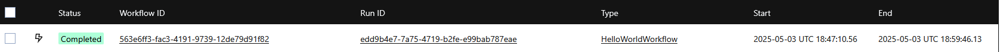

## clip-farmer-workflow

### About
Implementing the original [clip-farmer project](https://github.com/skhanal5/clip-farmer) as a Temporal Workflow. The goal is to be able to distribute the end to end flow of producing short form content with durable execution. 

### Development

#### Running against the Local Temporal Server

1. Install the Temporal CLI using `brew` if you don't have it installed already. 

2. Spin up the Temporal UI and the Temporal Server locally
    ```bash
    temporal server start-dev --ui-port 8080
    ```
    This will spin up the UI at: http://localhost:8080 and the server at:http://localhost:7233

3. Execute a Workflow
    ```bash
    # Example using HelloWorldWorkflow
    temporal workflow start \
        --task-queue default \
        --type HelloWorldWorkflow \
        --input '{"name":"Bob"}'
    ```

4. Start the Temporal Worker
    ```bash
    make run
    ```

5. View the results of the workflow on the UI 