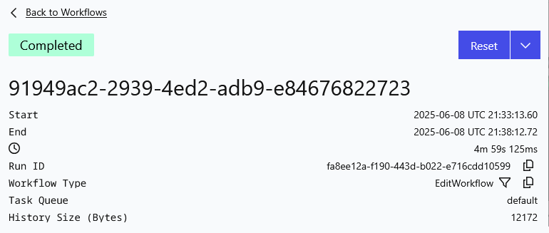

## content-worker

### About
Implementing the original [clip-farmer project](https://github.com/skhanal5/clip-farmer) as a Temporal Workflow. The goal is to be able to distribute the end to end flow of producing short form content with durable execution. 

### Disclaimer

This project is intended for educational purposes only. The author(s) of this project are not liable for any misuse or damage that may arise from the use of this project. Users of this project are responsible for ensuring that their use complies with all applicable laws, terms of service, and policies of third-party services.

Please use this project responsibly and ethically.

### Development

#### Environment Variables
You will need the following environment variables defined to run the main workflow:
```bash
export TWITCH_CLIENT_ID="FOO"
export TWITCH_CLIENT_SECRET="BAR"
export TWITCH_BASE_URL="BAZ"
```

#### Running against the Local Temporal Server

1. Install the Temporal CLI using `brew` if you don't have it installed already. 

2. Spin up the Temporal UI and the Temporal Server locally
    ```bash
    temporal server start-dev --ui-port 8080
    ```
    This will spin up the UI at: http://localhost:8080 and the server at:http://localhost:7233

3. Execute a Workflow
    ```bash
    # Example using Retrieve Clips
    temporal workflow start \
        --task-queue default \
        --type RetrieveClipsWorkflow \
        --input '{"Streamer":"plaqueboymax"}'
    ```

4. Start the Temporal Worker
    ```bash
    make run
    ```

5. View the results of the workflow on the UI 

You can refer to the `./worfklow_scripts` directory to see the other workflows that can be executed using this worker